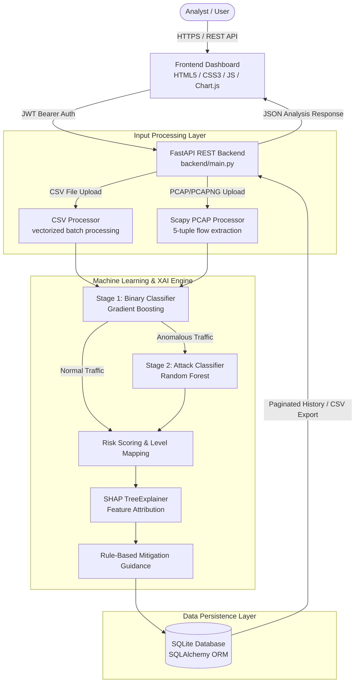

# NetGuard AI — Machine Learning Based Network Intrusion Detection System

An ML-powered network security analysis platform for intrusion detection, attack-family classification, explainable AI, risk scoring, and auditable threat analysis.


---
## 🚀 Live Demo

[**Open NetGuard AI Live Demo →**](https://netguard-ai-985w.onrender.com)

## Overview

**NetGuard AI** is a capstone-level machine learning based Network Intrusion Detection System (NIDS) designed to analyze network traffic, identify anomalous activity, classify attack families, explain model decisions, and maintain an auditable detection history.

In modern cybersecurity operations, volume and complexity make raw network traffic inspection challenging. NetGuard AI addresses this by pairing 2-stage machine learning models with automated packet/CSV flow ingestion, SHAP (SHapley Additive exPlanations) explainability, and rule-based mitigation recommendations, accessible through a responsive analyst dashboard and REST API.

---

## Key Capabilities

- **Hierarchical ML Intrusion Detection:**
  - **Stage 1 Binary Classification:** Separates `normal` traffic from `anomaly` flows using a Gradient Boosting model.
  - **Stage 2 Multi-Class Taxonomy:** Classifies anomalous traffic into four distinct attack families: `DoS`, `Probe`, `R2L`, and `U2R`.
- **Probability-Based Risk Scoring:** Maps anomaly prediction probabilities to a 0–100 risk score with assigned severity levels (`Critical`, `High`, `Medium`, `Low`, `Normal`).
- **Flexible Network Traffic Ingestion:**
  - **CSV Batch Analysis:** Processes bulk feature logs via vectorized matrix operations.
  - **Scapy PCAP / PCAPNG Parsing:** Reconstructs 5-tuple network flows from raw packet captures (`.pcap`, `.pcapng`) into 41-feature vectors.
- **Explainable AI (SHAP XAI):** Generates local feature attribution trees to pinpoint exact network feature contributions driving high-risk predictions.
- **Threat Mitigation Guidance:** Provides rule-based defense recommendations tailored to detected attack families.
- **Auditable History & CSV Export:** Persists detection logs in an indexed SQLite database with user-isolated CSV export featuring formula-injection protection.
- **Analyst Web Dashboard:** Dark-themed web UI with interactive risk summaries, SHAP inspection modals, and raw payload inspect accordions.
- **RESTful API & Security:** Fully documented OpenAPI endpoints secured with OAuth2 JWT bearer authentication and PBKDF2-SHA256 password hashing.
- **Docker Ready & Test Verified:** Containerized with `python:3.11-slim` and verified by an automated 28-test Pytest suite.

---

## System Architecture



---

## Machine Learning Pipeline

NetGuard AI employs a 2-stage hierarchical classification architecture trained on the NSL-KDD dataset (`KDDTrain+_20Percent`).

```
                              Raw Traffic / Flow Vector
                                          │
                                          ▼
                         ┌─────────────────────────────────┐
                         │   Stage 1: Binary Classifier    │
                         │       (Gradient Boosting)       │
                         └────────────────┬────────────────┘
                                          │
                        ┌─────────────────┴─────────────────┐
                        │                                   │
                  [Normal Flow]                     [Anomalous Flow]
                        │                                   │
                        ▼                                   ▼
             Probability Risk Score            ┌───────────────────────────┐
                (Label: Normal)                │  Stage 2: Taxonomy Model  │
                                               │      (Random Forest)      │
                                               └────────────┬──────────────┘
                                                            │
                                        ┌───────────────────┼───────────────────┐
                                        ▼                   ▼                   ▼
                                       DoS                Probe                R2L / U2R
```

### Stage 1 — Binary Intrusion Detection

- **Goal:** Predict whether a network flow is `normal` or an `anomaly`.
- **Model:** Gradient Boosting Classifier (`scikit-learn`).
- **Feature Pipeline:** 41 raw input features passed through numerical scaling (`StandardScaler`) and One-Hot Encoding for categorical features (`protocol_type`, `service`, `flag`).
- **Stratified Validation Results (20% Split):**
  - **Accuracy:** `99.68%`
  - **F1-Score:** `99.66%`
  - **Precision:** `99.83%`
  - **Recall:** `99.49%`

> **Validation Note:** Metrics represent stratified offline validation on the dataset split. Real-world network traffic conditions may vary.

### Stage 2 — Attack Family Taxonomy Classification

- **Goal:** Classify detected anomalies into specific threat categories.
- **Model:** Multi-Class Random Forest Classifier (`scikit-learn`).
- **Target Classes (4 Attack Families):**
  - **DoS (Denial of Service):** Resource exhaustion attacks (e.g., `neptune`, `smurf`, `back`).
  - **Probe:** Reconnaissance and port scanning (e.g., `ipsweep`, `satan`, `portsweep`, `nmap`).
  - **R2L (Remote to Local):** Unauthorized remote access attempts (e.g., `warezclient`, `guess_passwd`).
  - **U2R (User to Root):** Privilege escalation attempts (e.g., `buffer_overflow`, `rootkit`).
- **Stratified Validation Metrics:**
  - **Accuracy:** `99.91%`
  - **Weighted F1-Score:** `99.91%`
  - **Macro F1-Score:** `91.34%`

> **Imbalance Note:** The Macro F1 score (`91.34%`) reflects the challenge of extreme class imbalance in the training data, where rare attack families like U2R comprise only 11 samples compared to 9,234 DoS samples.

---

## Risk Scoring

Anomaly risk scores are derived dynamically from the Stage 1 model's anomaly probability:

$$\text{Risk Score} = \text{Anomaly Probability} \times 100$$

### Severity Thresholds

| Risk Score Range | Risk Level | Description |
| :---: | :---: | :--- |
| $\ge 90.0$ | `Critical` | High anomaly confidence with severe threat potential |
| $75.0 - 89.9$ | `High` | Strong indication of malicious activity |
| $60.0 - 74.9$ | `Medium` | Elevated suspicious traffic requiring review |
| $40.0 - 59.9$ | `Low` | Borderline anomalous characteristics |
| $< 40.0$ | `Normal` | Expected benign network flow behavior |

> **Disclaimer:** The risk score is a model-derived statistical indicator and does not guarantee that an event is malicious.

---

## Explainable AI (SHAP)

To prevent black-box decisions in security analysis, NetGuard AI integrates SHAP (`SHapley Additive exPlanations`):

- **Engine:** `shap.TreeExplainer` applied to the Gradient Boosting pipeline.
- **Local Attribution:** Computes exact Shapley values for individual traffic flows, identifying top features pushing predictions toward `anomaly` or `normal`.
- **Key Feature Identifiers:** Highlights critical indicators such as `count`, `serror_rate`, `same_srv_rate`, `src_bytes`, and `dst_host_serror_rate`.
- **Bulk CSV Optimization:** Applies SHAP explainability selectively to top high-risk detections during large batch processing to optimize latency.

---

## Input Processing & Technical Limitations

### CSV Analysis
- Supports batch upload of pre-extracted 41-feature network records.
- Uses vectorized Pandas/NumPy array operations.
- Validated via manual processing test on `22,544` network connection records.

### PCAP / PCAPNG Analysis
- Ingests raw `.pcap` and `.pcapng` packet files using `Scapy`.
- Extracts 5-tuple flow records (Source IP, Destination IP, Source Port, Destination Port, Protocol) and aggregates connection metrics.

### Technical Limitation Disclosures
1. **Feature Extraction Gap:** The benchmark NSL-KDD feature set includes host/content-level variables (e.g., `num_failed_logins`, `num_compromised`, `root_shell`) that cannot be reconstructed from raw or encrypted packet headers alone.
2. **Default Feature Handling:** Unavailable PCAP features are assigned documented default baseline values during packet parsing.
3. **Validation Scope:** Offline validation metrics demonstrate algorithm performance on benchmark data and should not be interpreted as a guarantee of identical real-world network accuracy.

---

## Dataset Summary

Model training and validation use the benchmark **NSL-KDD (`KDDTrain+_20Percent`)** dataset.

- **Total Training Records:** 25,192
- **Feature Vector Length:** 41 raw features (3 categorical, 36 numerical, 2 constant)
- **Binary Distribution:** 13,449 Normal (`53.39%`) | 11,743 Anomaly (`46.61%`)

### Attack Family Class Distribution

| Family | Category | Samples | Dataset Share |
| :--- | :--- | :---: | :---: |
| **Normal** | Safe Traffic | 13,449 | 53.39% |
| **DoS** | Denial of Service | 9,234 | 36.65% |
| **Probe** | Reconnaissance / Scanning | 2,289 | 9.09% |
| **R2L** | Remote to Local | 209 | 0.83% |
| **U2R** | User to Root | 11 | 0.04% |

---

## Technology Stack

| Layer | Component / Library | Purpose |
| :--- | :--- | :--- |
| **Language** | Python 3.10+ | Primary backend & ML execution environment |
| **Backend Web Framework** | FastAPI, Uvicorn | High-performance asynchronous REST API service |
| **Machine Learning** | Scikit-Learn, Joblib | Model pipelines, Gradient Boosting, Random Forest |
| **Explainable AI** | SHAP | TreeExplainer feature contribution analysis |
| **Data Processing** | Pandas, NumPy | Vectorized matrix transformations & batch processing |
| **Network Analysis** | Scapy | Raw PCAP / PCAPNG packet & flow parsing |
| **Database & ORM** | SQLite, SQLAlchemy | Persistent detection history & log storage |
| **Security & Auth** | PyJWT, Passlib (PBKDF2-SHA256) | OAuth2 bearer token authentication & password hashing |
| **Frontend UI** | HTML5, CSS3, JavaScript, Chart.js | Responsive SOC analyst dashboard & visualizations |
| **Containerization** | Docker (`python:3.11-slim`) | Standardized deployment container |
| **Testing** | Pytest, HTTPX | Automated API, auth, DB, ML, and PCAP test coverage |

---

## Repository Structure

```
NetGuard-AI/
├── backend/                  # FastAPI web server, auth, endpoints, & database models
│   ├── auth.py               # JWT generation, verification & password hashing
│   ├── database.py           # SQLite database connection & session setup
│   ├── dependencies.py       # FastAPI auth & DB session dependencies
│   ├── main.py               # Primary REST API routes & app configuration
│   ├── models.py             # SQLAlchemy User & DetectionLog ORM models
│   ├── schemas.py            # Pydantic data validation models
│   └── services/             # CSV and Scapy PCAP ingestion processors
├── data/                     # Training & sample datasets (Train_data.csv, etc.)
├── docs/                     # Deployment documentation (ibm_cloud_deployment.md)
├── frontend/                 # Web dashboard interface (index.html, app.js, styles.css)
├── models/                   # Serialized ML model artifacts & metrics.json
├── reports/                  # Model evaluation reports & dataset metrics JSONs
├── src/                      # ML pipeline training, feature engineering, & prediction scripts
├── tests/                    # Pytest automated test suite (28 unit & API tests)
├── Dockerfile                # Docker container build definition (python:3.11-slim)
├── .dockerignore             # Excluded files from Docker build context
├── .env.example              # Environment configuration template
├── .gitignore                # Git version control ignore rules
├── LICENSE                   # MIT License
├── README.md                 # Primary project documentation
└── requirements.txt          # Python project dependencies
```

---

## API Documentation

FastAPI automatically generates interactive OpenAPI / Swagger documentation at `/docs` when the backend is running.

### Core Endpoints

| Method | Endpoint | Auth Required | Description |
| :--- | :--- | :---: | :--- |
| `GET` | `/health` | No | System health check & ML model status |
| `POST` | `/api/auth/register` | No | Register a new analyst account |
| `POST` | `/api/auth/login` | No | Authenticate & obtain OAuth2 JWT bearer token |
| `GET` | `/api/auth/me` | Yes | Retrieve current authenticated user profile |
| `POST` | `/predict` | Optional | Analyze a single 41-feature JSON payload |
| `POST` | `/api/analyze/file` | Optional | Analyze uploaded `.csv`, `.pcap`, or `.pcapng` file |
| `GET` | `/api/history` | Yes | Fetch paginated detection history & aggregate KPIs |
| `GET` | `/api/history/export?format=csv` | Yes | Download authenticated user's audit log as sanitized CSV |
| `DELETE`| `/api/history` | Yes | Clear stored detection history records |
| `GET` | `/api/metrics` | No | Fetch trained model metrics & evaluation metadata |
| `GET` | `/api/samples` | No | Retrieve pre-filled sample feature vectors |

---

## Security Implementation

- **JWT Authentication:** Stateful token creation using HS256 algorithm with configurable expiration.
- **Password Hashing:** Passlib PBKDF2-SHA256 password hashing to ensure credential security.
- **User Log Isolation:** History exports (`GET /api/history/export`) strictly filter records by `user_id` so analysts only download their own session data.
- **CSV Formula Injection Sanitization:** Exported CSV values starting with dangerous characters (`=`, `+`, `-`, `@`) are automatically prepended with a single quote (`'`) to block spreadsheet macro execution.
- **Configurable Environment Security:** Supports environment-driven secrets (`JWT_SECRET_KEY`), CORS origin controls (`CORS_ORIGINS`), and file upload size caps (`UPLOAD_MAX_SIZE_MB`).

---

## Performance & Latency Tracking

The analysis endpoints (`POST /api/analyze/file` and `POST /predict`) capture high-resolution execution metrics using `time.perf_counter()`:

- `parsing_latency_ms`: Time spent extracting network flows from raw PCAP or CSV files.
- `inference_latency_ms`: Time spent running Stage 1 & Stage 2 ML predictions and SHAP calculations.
- `total_processing_time_ms`: End-to-end processing latency.
- `average_flow_latency_ms`: Calculated per-flow latency across batch records.

Optimizations include vectorized Pandas prediction pipelines, cached SHAP `TreeExplainer` instances, and top-k SHAP evaluation for bulk CSV analysis.

---

## Testing & Quality Assurance

The repository includes a 28-test automated Pytest suite covering all major components:

```powershell
python -m pytest tests/ -v
```

### Verified Test Summary

```
============================== 28 passed in 11.00s ==============================
```

- **API & Endpoints (`tests/test_api.py`):** Health, auth, single predict, CSV batch, history, CSV export.
- **Authentication (`tests/test_auth.py`):** Password hashing, JWT token creation, decoding, expiration.
- **Database (`tests/test_database.py`):** User creation, DetectionLog CRUD, querying.
- **PCAP Parsing (`tests/test_pcap.py`):** Scapy flow extraction & 41-feature mapping using synthetic PCAP.
- **ML Pipeline (`tests/test_pipeline.py`):** Feature preprocessing, model artifact verification, inference.
- **Stage 2 Multi-Class (`tests/test_stage2.py`):** Attack taxonomy loading, class inference, trigger logic.
- **Explainable AI (`tests/test_xai.py`):** SHAP value calculations & rule-based mitigation lookups.

---

## Local Installation & Setup

### Prerequisites

- Python 3.10+
- Git

### Installation Steps (Windows PowerShell)

1. **Clone the repository:**
   ```powershell
   git clone https://github.com/Ajith-Kumar55/NetGuard-AI.git
   cd NetGuard-AI
   ```

2. **Create and activate a virtual environment:**
   ```powershell
   python -m venv venv
   .\venv\Scripts\Activate.ps1
   ```

3. **Install dependencies:**
   ```powershell
   pip install -r requirements.txt
   ```

4. **Configure environment variables:**
   ```powershell
   Copy-Item .env.example .env
   ```

   > **Security Note:** Update `JWT_SECRET_KEY` in `.env` to a strong random string before deploying.

### Launching the Application

Start the backend server using Uvicorn:

```powershell
python -m uvicorn backend.main:app --host 127.0.0.1 --port 8080
```

Access the dashboard in your web browser:
**`http://127.0.0.1:8080/`**

#### Portfolio Demo Credentials
- **Username:** `admin`
- **Password:** `admin123`

---

## Docker Deployment

Build and launch the application container locally using Docker:

```bash
# Build Docker image
docker build -t netguard-ai-nids .

# Run container bound to port 8000
docker run -p 8000:8000 netguard-ai-nids
```

The container uses `python:3.11-slim`, exposes port `8000`, and dynamically binds to the `$PORT` environment variable.

---

## Environment Configuration

The application is configured using variables defined in `.env`:

| Variable | Default | Purpose |
| :--- | :--- | :--- |
| `DATABASE_URL` | `sqlite:///./netguard.db` | SQLAlchemy database connection string |
| `JWT_SECRET_KEY` | `replace-with-a-long-random-secret` | Secret key used for signing JWT tokens |
| `JWT_ALGORITHM` | `HS256` | Cryptographic algorithm for JWT signatures |
| `ACCESS_TOKEN_EXPIRE_MINUTES` | `1440` | JWT token validity duration (24 hours) |
| `CORS_ORIGINS` | `http://127.0.0.1:8080` | Allowed origins for Cross-Origin Resource Sharing |
| `UPLOAD_MAX_SIZE_MB` | `50` | Maximum file upload size limit in megabytes |

---

## IBM Cloud Deployment Status

**Deployment Status:** `Configuration Prepared | Live Deployment Not Completed`

The repository includes container configuration (`Dockerfile`, `.dockerignore`, dynamic `$PORT` handling) designed for serverless container deployment platforms such as IBM Cloud Code Engine. A live IBM Cloud instance was not deployed as part of this project phase. Complete preparation steps are documented in [`docs/ibm_cloud_deployment.md`](docs/ibm_cloud_deployment.md).

---

## Future Improvements

- **Database Scaling:** Migration from SQLite to PostgreSQL for concurrent production persistence.
- **Real-Time Packet Ingestion:** Streaming packet capture interface using live network interface hooks.
- **Enhanced PCAP Feature Extraction:** Deep packet inspection for fuller reconstruction of host/content features.
- **Advanced Imbalance Handling:** SMOTE or cost-sensitive learning for rare attack families (U2R/R2L).
- **Model Drift Monitoring:** Automated tracking of prediction distribution changes over time.
- **SIEM / Enterprise Integration:** Syslog and CEF export format options for SIEM integration.

---

## Project Status

**Completed Capstone / Portfolio Project**

- [x] Core 2-Stage ML NIDS implemented & validated
- [x] Attack taxonomy classification (DoS, Probe, R2L, U2R) operational
- [x] SHAP Explainable AI integration complete
- [x] Scapy PCAP & CSV file ingestion functional
- [x] JWT authentication & security isolation active
- [x] Sanitized CSV audit log export implemented
- [x] Docker container build configuration ready
- [x] 28/28 Pytest automated tests passing

---

## Author

**Ajithkumar H M**
Computer Science and Engineering Student

- **GitHub:** [Ajith-Kumar55](https://github.com/Ajith-Kumar55)

---

## License

This project is open source and licensed under the [MIT License](LICENSE).
